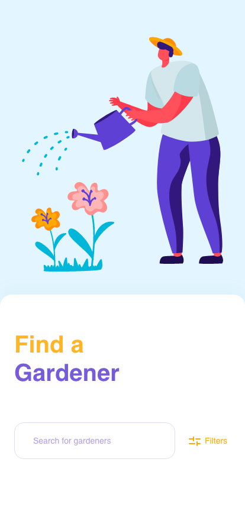
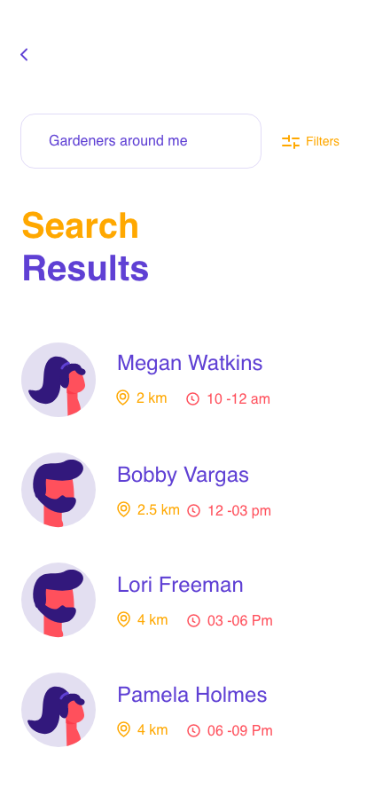
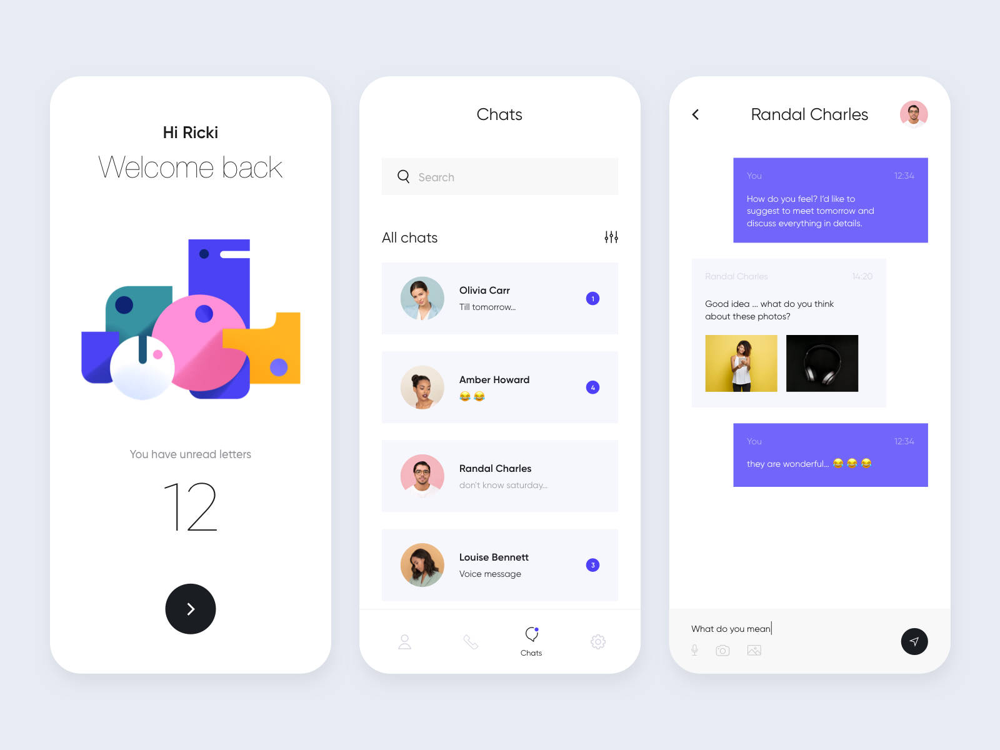

# Flutter_UI_Reality

 

 
      
 

                     
                                          Simple Code
                                                               Awesome UI

 

 
 
      
 

<h2> Project 01 ✅   </h2> 

  <a href="https://github.com/kelvin147789/Flutter_UI_Reality/tree/master/gardener_01">Gardener_01 </a>
  
       
  
  
  
<h2> Project 02 ✅  </h2>  

  <a href="https://github.com/kelvin147789/Flutter_UI_Reality/tree/master/friendly_forest_02">Friendly_Forest_02 </a>
  
   
  
  
  
<h2> Project 03 ✅ </h2> 

  <a href="https://github.com/kelvin147789/Flutter_UI_Reality/tree/master/market_app_03">Market_App_03 </a>
  
   
  
  
  <h2> Project 04 ✅  </h2> 

  <a href="https://github.com/kelvin147789/Flutter_UI_Reality/tree/master/mobile_application_activity_04">Application_Activity_04 </a>
  
   
  
  <h2> Project 05 👨🏽‍💻  </h2>  

  <a href="https://github.com/kelvin147789/Flutter-UI-Reality/tree/master/mobile_app_misaki_05">Mobile App Misaki 05</a>
  
   
  
   

   

# Support My work 🦄:

     BTC Address:
 
    3Eqg2Wm9978CmcDJp4z3yM2CqjUu19Vuru
    
     ETH Address:
 
    0x463d1d31eEEC94952D852046cF15913d02F627b8

    
