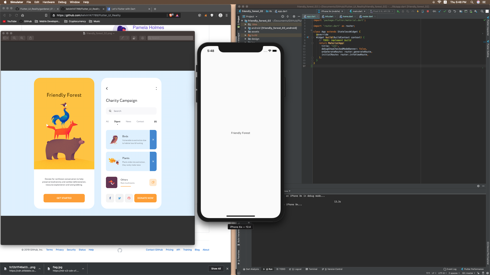
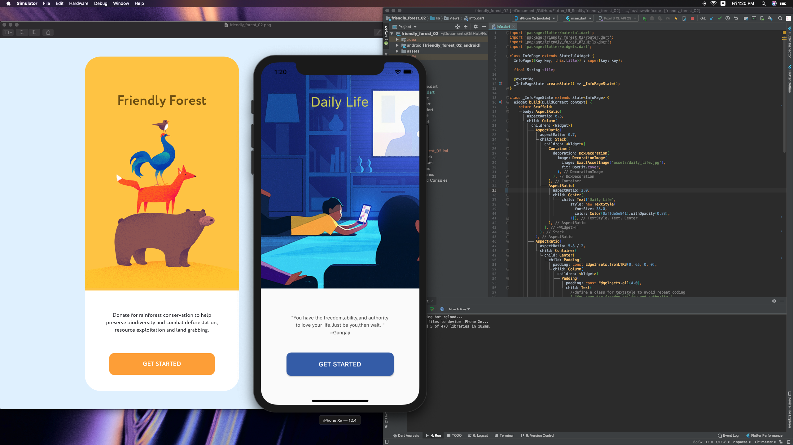

# friendly_forest_02

That would be amazing.<a href ="https://dribbble.com/shots/7080175-Mobile-app-Friendly-Forest?fbclid=IwAR2P8GKmfEbdhKcuM3MsbNxrc2F82s3nQOsXXfJvtoNmbqtRoC98azuMIUM"> Design</a>

# Day 1
 

# Day 2
 

    The style of font needs to be changed.(Family,Align) *Updated
    
# Day 3
 

    - Objectives: Input Decoration + TabController
    - Probably try IndexedStack to switch the page with index later on *Waiting to test
    - Declare a variable at first at first and change its value with setState and and 
    - use that variable later on and build Widgets according to that variable using if else or switch case.
  <a href ="https://stackoverflow.com/questions/57889326/how-to-add-a-circular-dot-as-an-indicator-in-flutter-tabs">Dot Circle Tab Indicator </a>
  
         
