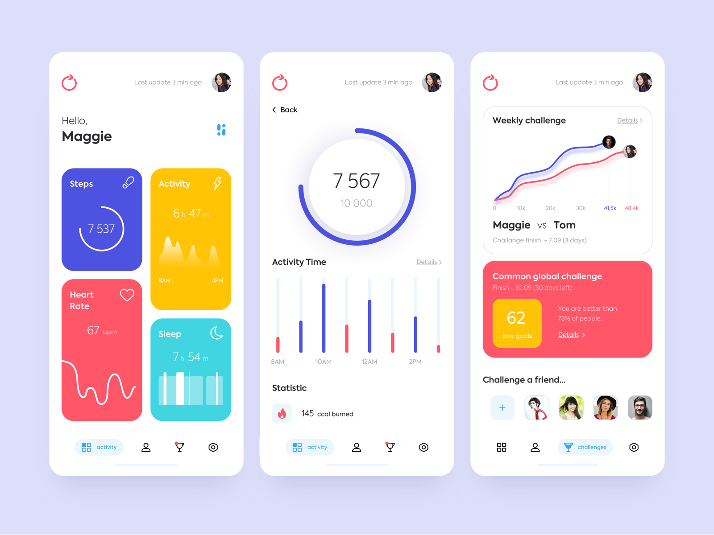
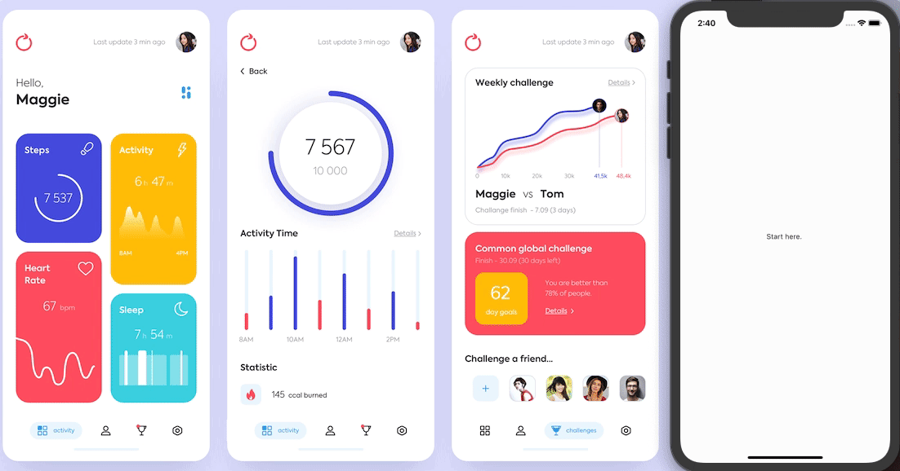
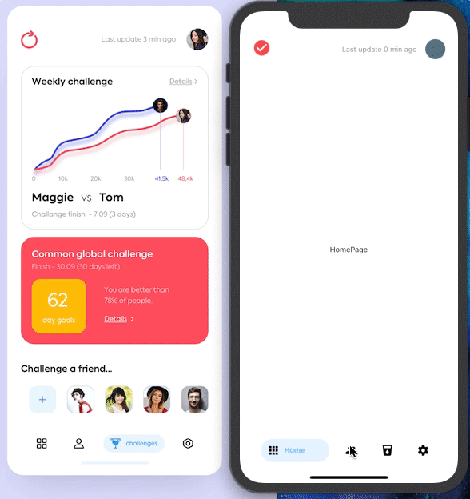
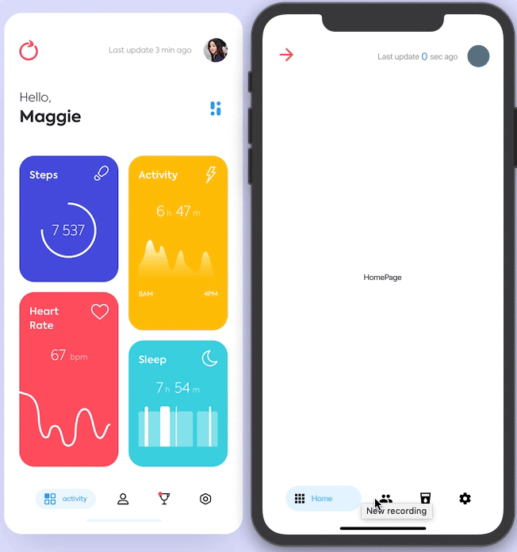
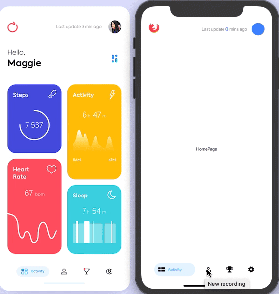

# mobile_application_activity_03

Let's draw some line. <a href= "https://dribbble.com/shots/7119123-Mobile-application-Activity">Design</a>

 

# Day 1
  
    
    - Start a new journey.
    To do:
    - Use bottom_navy_bar ✅    
    - Use Flexible + FractionallySizedBox for the layout 
    - Use Hero to expand > page 2
    - Use AnimationController for building UI(Content)
      
    
 Good example for how to use List data:
 
   https://www.youtube.com/watch?v=leA2nZYM9jY&t=480s
   
  🔥Recommended for using different type of data:
  
  
   <a href="https://github.com/kelvin147789/flutter-ui-resources/tree/d16507f761e6800fdd6d7bae61cd861ff801c7e2/Example/Best-Flutter-UI-Templates-master/best_flutter_ui_templates/lib/fitnessApp/models">ListData</a>
   
   # Day 2
  
    
    - A good Start
    To do:
    - Use CustomIcon + dio for building appBar's content
    - Use DateTime for 'x' mins ago ✅  (Use seconds for better demonstration)
    - Use flutter_shimmer for chart effect!
    - Use FadeInImage for loading image from Internet
    - In addition,learn how to implement google_map_flutter 
    - Use ValueListenableBuilder to value data in one time
Good resources to create a time loop:
<a href="https://stackoverflow.com/questions/14946012/how-do-i-run-a-reoccurring-function-in-dart">reoccurring function, in Dart?</a>
    
    
   # Day 3
  
    
    - A struggle period
    To do :
    - Learn Async/Await
    
Quick way to launch simulator in VSCODE:

    open -a simulator
    flutter run
    
<a href="https://www.youtube.com/watch?v=EwHMSxSWIvQ&t=518s"> Building Lists with JSON Data </a>

    
   # Day 4
  

    - iOS13 is nuts! Hot restart did not work
    - I would use AssetImage for the icon with inkWell
    - But at least would do the animation
    - http asset would not be implemented into this project,instead,json list data would be used mainly.
 
     
